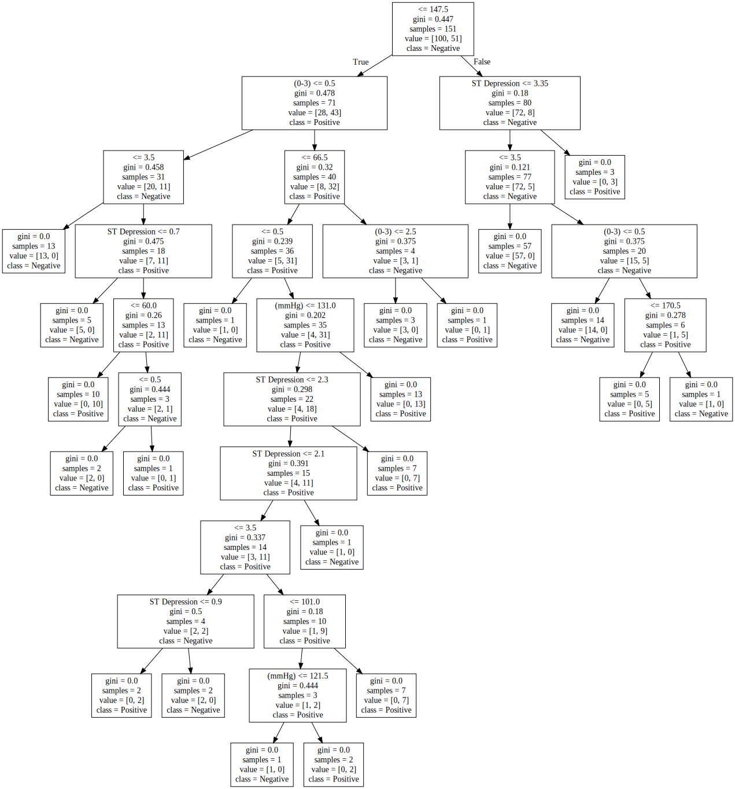

# 심장 질환 진단 엔진의 개발과 시각화

161138 조성현

## 목차

1. 서론
	1. 연구 배경 및 필요성
	1. 문헌 조사
	1. 연구 목적, 방향, 예상 결과

1. 본론
	1. 문제 정의 (Problem Definition)
	1. 해결책 설계 (Solution Planning)
	1. 실행 (Execution)
	1. 검증 (Testing)
	1. 배포 (Distribution)

1. 결론
	1. 결론 및 기대 효과
	1. 향후 보완 계획

1. 부록
	1. 참고 자료
	1. 소스 코드 (Source Code)
	1. 의사 결정 트리 시각화 이미지
	1. 학습에 활용된 데이터 세트 전체


## I. 서론

### 연구 배경 및 필요성

지난 10년 동안, 심장 질환으로 인한 사망률은 약 40% 증가했다. 조만간 우리나라 사망률 1위에 오를지도 모른다는 전문가들의 염려에도 심장 질환을 조기에 발견하지 못하여 사망하는 사람들이 있고, 이 중에 는 의료 사각지대에 놓인 사람이 많다. 만약 간단한 인공지능을 이용해서 심장 질환의 가능성을 알아볼 수 있다면 부정확하더라도 큰 의미를 가질 수 있을 것이다.

### 문헌 조사

해당 분야는 연구가 상당히 진척되어있다. 이 중 가장 지도적인 역할은 Apple으로, 2018년 Stanford University와 제휴하여 미국 내에서 Apple Watch 이용자를 대상으로 심장 연구를 진행한 바 있다. Apple은 해당 기능에 대한 연구를 완료하고 자사 제품의 심박 건강 확인 기능에 도입하였다. 인공 지능 라이브러리 개발의 선두를 달리고 있는 Google 또한 환자의 눈을 보고 심장 질환을 진단할 수 있는 알고리즘 개발에 착수한 바 있다. 이처럼 심혈관 질환은 사람의 생명에 치명적인 질환이기 때문에, 많은 기업들 이 선도적으로 연구를 진행하고 있다.

반면 개인이 이런 연구를 진행한 선례는 많지 않다. 이런 연구는 시간과 자원이 많이 들어가기 때문이 다. 전문적인 인공지능의 개발 또한 매우 어렵지만, 데이터 자체를 구하는 것이 가장 어렵다. 안정적인 인공 지능을 개발하기 위해서는 작게는 수 천, 많게는 수십 억 개의 데이터가 기본적으로 필요하다. 심장 질환의 연 구 같은 경우에는 환자 혹은 일반인들이 각각 데이터가 하나가 되므로, 최소한 수 백에서 수 천 명의 환자들 의 데이터를 수집해야 한다는 의미가 된다. 개인이 이런 규모의 연구를 진행하기에는 무리가 있으며, 때문에 공공 기관 혹은 기업이 데이터를 오픈 소스로 공유하면 이를 통해 개인들이 인공지능 모델을 자유롭게 개발하는 경우가 많다.

### 연구 목적, 방향과 예상 결과

해당 연구 또한 마찬가지의 방법을 통할 것이다. 궁극적인 연구 목적은 우리나라 국민들을 대상으로 심혈관 질환 데이터를 수집하여 모두가 다운로드하고 사용할 수 있는 인공지능 기반 앱을 개발하는 것이다. 하지만 이는 장기간 데이터를 수집하고 연구 및 개발을 진행해야 하는 사항으로, 본 연구에서는 그 초석을 마련하기 위해 오픈 소스로 공개된 심혈관 질환 정보를 이용하여 심혈관 질환 진단 엔진을 개발하고 해당 엔진의 의사 결정 트리를 시각화해보려 한다.

## II. 본론

### 문제 정의

해당 연구는 University of California Irvine이 Machine Learning Repository의 일환으로 공개한 Heart Disease UCI 데이터 세트(일명 ‘클리블랜드 데이터 세트’)를 이용할 것이다. 원본 데이터는 총 76개의 문항을 가지고 있지만 공개된 데이터 세트는 14개의 문항을 가지고 있다. 총 303 개의 익명 데이터가 공개되어 있으며, 데이터는 다음과 같이 제공된다. 데이터 전체가 `.csv` 확장자로 된 스프레드시트의 형태이며, 부록에 첨부되어 있다.

|age|sex|cp|trestbps|chol|fbs|restecg|thalach|exang|oldpeak|slope|ca|thal|target|
|----|----|----|----|----|----|----|----|----|----|----|----|----|----|
|63|1|1|145|233|1|2|150|0|2.3|3|0|fixed|0|
|67|1|4|160|286|0|2|108|1|1.5|2|3|normal|1|
|67|1|4|120|229|0|2|129|1|2.6|2|2|reversible|0|
|37|1|3|130|250|0|0|187|0|3.5|3|0|normal|0|
|41|0|2|130|204|0|2|172|0|1.4|1|0|normal|0|
|...|...|...|...|...|...|...|...|...|...|...|...|...|...|

이 중 각 문항이 나타내는 정보를 구체화하자면 다음과 같다. 이 설명의 출처는 부록에 첨부되어 있다.

|문항|한글명|설명|유형|타입|
|----|----|----|----|----|
|`age`|나이|나이가 숫자로 주어진다.|수치|`int`|
|`sex`|성별|여성은 0, 남성은 1의 범주로 구분되어 주어진다.|범주|`int`|
|`cp`|가슴 통증 유형|가슴 통증 유형을 0에서 4로 나눈다.|범주|`int`|
|`trestbps`|안정 시 혈압|병원 입원 시 혈압이 mmHg로 주어진다.|수치|`int`|
|`chol`|혈청 콜레스테롤|혈청의 콜레스테롤 농도가 mg/dl로 주어진다.|수치|`int`|
|`fbs`|공복 혈당|공복 시 혈당이 120mg/dl를 초과하지 않는다면 0, 초과한다면 1의 값이 주어진다.|범주|`int`|
|`restecg`|안정 심전도 결과|안정 심전도 결과가 0, 1, 2로 구분하여 주어진다.|범주|`int`|
|`thalach`|최대 심박수|최대 심박동수가 수치로 주어진다.|수치|`int`|
|`exang`|협심증 유발 양상|심장 운동이 협심증을 유발하지 않는다면 0, 유발한다면 1의 값이 주어진다.|범주|`int`|
|`oldpeak`|운동 유발 ST 하강|운동으로 유발되는 ST 분절 하강 (심장 박동 직후 심장의 운동) 의 값이 수치로 주어진다.|수치|`int`|
|`slope`|ST 분절 기울기|ST 분절의 최대 기울기가 수치로 주어진다.|수치|`int`|
|`ca`|주요 혈관 개수|형광 투시된 주요 혈관의 수가 0에서 3의 값으로 주어진다.|수치|`int`|
|`thal`|심장 결함 유형|심장 결함의 유형이 없음, 해결된 결함, 해결 가능한 결함으로 구분되어 주어진다.|범주|`String`|
|`target`|심장병 진단|심장병이 발병하였으면 1, 발병하지 않았으면 0의 값을 가진다.|범주|`int`|

### 해결책 설계 (Solution Planning)
다음의 과정을 통해 기계 학습을 시킬 것이다. 또한 데이터를 가공하기 위해 다음의 외부 Library를 사용할 예정이다. 전부 Python 3에 기반해 있다.

#### 1. 데이터의 입력

데이터를 컴퓨터에 입력하는 과정이다. 이 과정에서 `Pandas`를 사용하며, 수학적 데이터를 `Python`에서 다룰 수 있도록 도와주는 라이브러리이다. `Pandas`를 활용하여 원본 `.csv` 파일을 읽어와서 `Pandas` 데이터 프레임으로 변환하여 사용한다.


#### 2. 데이터의 전처리 `Preprocessing`

기계 학습을 할 수 있도록 데이터를 전처리하는 과정이다. 이 과정에서 Scikit-Learn (sklearn) 라이브러리를 활용하며, Python에서 간단한 기계 학습을 도와주는 라이브러리이다. 전처리는 다음의 과정을 거친다.

1. 입력 데이터를 기계 학습이 가능한 형태로 변환한다. (`sklearn.preprocessing.LabelEncoder` 사용)
2. 변환된 데이터를 학습 데이터와 검증 데이터로 분류한다. 이때 데이터는 절반으로 나눈다. 즉, 303
개의 데이터 중 151개는 훈련용이며, 152개는 검증용으로 사용된다. (`sklearn.model_selection.train_test_split` 사용)

#### 3. 데이터의 학습

데이터는 패턴 인식과 분류 (`Grouping`) 혹은 의사 결정 트리 제작, 총 2가지 방법으로 이용할 것이다. 이 과정에서 `Support Vector Machine`과 `Tree`를 활용한다.

1. 훈련 데이터에서 독립 변수 13개와 종속 변수 1개를 분리하여 각각 `Xtrain`, `Ytrain`으로 둔다.
2. `SVM`과 `Tree`를 활용해 각각 `Input`에 `Xtrain`, `Output`에 `Ytrain`을 두고 모델을 학습시킨다. (`sklearn.svm` 사용)


#### 4. 학습 데이터의 검증
1. 검증 데이터에서 독립 변수 13개와 종속 변수 1개를 분리하여 각각 `Xcheck`, `Ycheck`로 둔다.
2. 학습된 모델에 `Xcheck`를 대입한 뒤 구해지는 `Ypredict`를 `Ycheck`로 채점한다. 정답인 경우 1점을 부여하고 오답일 경우 0점을 부여해서 평균 점수를 구한다. (`sklearn.metrics` 사용)

#### 5. 데이터의 시각화

의사 결정 트리의 경우 데이터를 시각화한다. (`sklearn.tree`, `graphviz` 사용)

### 실행 (Execution)

개발은 Google Colab이라는 온라인 개발 환경을 활용했다. Jupyter Notebook이라는 환경을 통해 개발했는데, Jupyter Notebook은 상호 작용이 가능한 여러 코드 블록으로 구성되어 있어 여러 모듈을 동시에 검증할 때 유용하다. 코드의 전문은 부록에 첨부되어 있다.

유의할 점은, 완성된 모델은 총 2가지라는 점이다. 하나는 `Support Vector Machine`을 활용한 범주화 모델(`sklearn.svm.classes.SVC object` 형태)이고, 나머지 하나는 `Tree`와 `Node`를 활용한 의사 결정 트리(`sklearn.tree.tree.DecisionTreeClassifier Object` 형태)의 형태이다. 각각의 경우 모두 `sklearn` 모듈의 함수를 활용했다.

### 검증 (Testing)

미리 분리해놓은 검증 데이터 세트를 대입하여 값을 계산해보았다. `Support Vector Machine`을 활용한 경우 `0.7894736842105263` 점을 획득했다. 즉 약 78.95%의 적중률을 가졌다

의사 결정 트리의 경우 `0.7697368421052632` 점을 획득했다. 즉 약 76.97%의 적중률을 가졌다. 또한 의사 결정 트리에서 부록과 같은 이미지를 추출해낼 수 있었다.

### 배포 (Distribution)
모든 코드와 결과물, 그리고 의사 결정 트리의 벡터 이미지 형태를 GitHub에 업로드하였다. GitHub는 전 세계 수많은 프로그래머들이 자유롭게 자료를 공유하는 오픈 소스 커뮤니티이다.


## III. 결론

### 결론 및 기대 효과

본 연구를 통해 SVM와 의사 결정 트리를 이용해 약 75%에서 80%의 정확도를 가지는 학습 모델을 제작할 수 있음을 확인했다. 이와 같은 모델은 질병의 명확한 분별로 인한 장점도 가지지만, 무엇보다 주변 장비들과 복합적으로 연계되기 시작할 때 현실적인 파급력을 가진다. 이와 같은 모델이 90% 이상의 정확도를 가질 때까지 학습된다면, 기존에는 병원에 방문하지 못했던 사람도 자신의 의료 정보를 주변 스마트 기기를 활용해 측정하고 자신의 심장 질환 여부를 예측할 수 있는 것이다. 최근 스마트 기기들이 측정할 수 있는 데이터가 풍부해지고 있기 때문에, 머지않은 미래에 자신의 스마트 기기만으로 학습 모델의 모든 독립 변수를 측정할 수 있는 날이 온다면 전례 없던 큰 규모의 사람들이 자신의 스마트 기기만으로 심혈관 질환을 간편하게 진단할 수 있을 것이다.

### 문제점 및 향후 보완 계획

본 연구는 여러 가지 한계점을 가진다.

첫째, 데이터 자체에 문제가 있다. 해당 데이터는 1988년에 제작되었다. 30년 전에 비해, 인류는 생활 습관 및 소비 성향, 식사 문화 등이 모두 종합적으로 달라졌다. 때문에 과거의 자료를 가지고 학습을 해도 현대의 인류에 대입하기에는 문제가 있다. 또한 이 자료는 미국인을 기준으로 연구된 데이터이다. 해당 데이터는 서양인을 기준으로 제작되었기 때문에, 우리나라 사람들에게 적용하기에 무리가 있다. 마지막으로 300명은 일반화된 답을 구하기에는 적은 값이다. 다만 이 문제는 데이터 자체의 문제이므로, 데이터만 새롭게 제작할 수 있다면 그 데이터를 다시 대입하고 코드를 재실행하여 새로운 모델을 구하면 된다.

둘째, 심혈관 질환의 가능성은 13개의 항목으로 구하기 어려울 수 있다. 특히 건강과 관련된 질환은 영향을 줄 수 있는 요인이 수도 없이 다양하다. 이런 수많은 요인을 무시하고 13개의 요약된 항목들만으로 모델을 학습하는 것에는 한계가 있을 수밖에 없다. 이 또한 데이터 자체의 문제이긴 하지만, 제작한 모델 또한 13개의 학습 항목을 이용하기 때문에 이 문제에 개선하기 위해서는 데이터의 보강과 모델의 재설계가 같이 필요하다.

셋째, 심혈관 질환의 일반식은 범주화와 의사 결정 트리로 구할 수 없는 형태일지도 모른다. 이를 보완하기 위해 연구자들은 심층 인공신경망 등을 도입하여 해결하고 있다.

궁극적으로 이 연구를 보완하기 위해 필요한 것은 데이터의 항목과 응답자 수 모두에 대한 데이터 보강과, 더 정확한 학습 방식을 사용하는 것이다. 데이터의 보강을 위해서는 병원 혹은 기업 등의 협력이 필요하며, 더 정확한 학습 방식을 구하기 위해서는 고차원적인 학습 패러다임을 배우는 것뿐만이 아니라 심혈관 질환에 대해서도 깊은 이해를 가지고 문제에 접근해야 할 것이다.

## IV. 부록

### 참고 자료

#### [Apple 심혈관 질환 연구](https://med.stanford.edu/appleheartstudy.html)
Apple의 심혈관 질환 연구에 대한 세부 정보를 참고했습니다.


#### [Google 인공지능 뉴스](https://www.theverge.com/2018/2/19/17027902/google-verily-ai-algorithm-eye-scan-heart-disease-cardiovascular-risk)
Google의 심혈관 질환 인공지능 연구 동향에 대한 세부 정보를 참고했습니다.


#### [Kaggle](https://www.kaggle.com/ronitf/heart-disease-uci)
클리블랜드 데이터 세트 설명에 대한 세부 정보를 참고했습니다.


#### [Pandas](https://pandas.pydata.org/)
Pandas 사용법에 대한 세부 정보를 참고했습니다.


#### [Scikit Learn](https://scikit-learn.org/)
sklearn 사용법에 대한 세부 정보를 참고했습니다.

### 소스 코드 (Source Code)

#### [소스 코드 바로 가기](HeartDiagnosisEngine.ipynb)

### 의사 결정 트리 시각화 이미지

### 학습에 활용된 데이터 세트 전체

#### [heart.csv](heart.csv)
